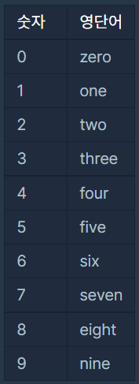
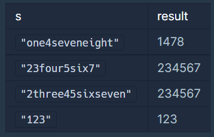
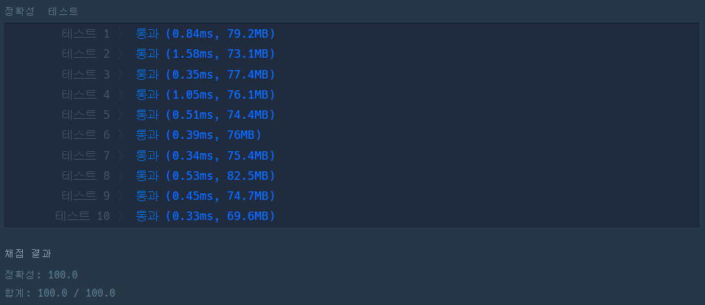
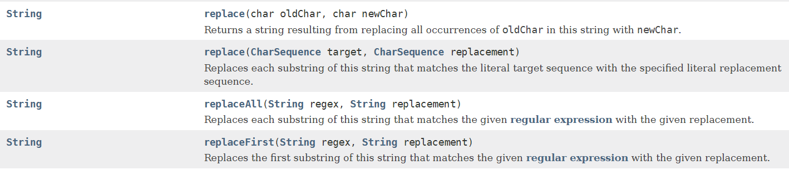

위 문제는 "숫자 문자열과 영단어"에 관한 설명이다.

"replace"와 "replaceAll"의 차이점도 찾아본다.

---

## 상황 설명

네오와 프로도가 숫자놀이를 하고 있습니다. 

네오가 프로도에게 숫자를 건넬 때 일부 자릿수를 영단어로 

바꾼 카드를 건네주면 프로도는 원래 숫자를 찾는 게임입니다.

다음은 숫자의 일부 자릿수를 영단어로 바꾸는 예시입니다.

* 1478 → "one4seveneight"
* 234567 → "23four5six7"
* 10203 → "1zerotwozero3"

이렇게 숫자의 일부 자릿수가 영단어로 바뀌어졌거나, 

혹은 바뀌지 않고 그대로인 문자열 s가 매개변수로 주어집니다. 

s가 의미하는 원래 숫자를 return 하도록 solution 함수를 완성해주세요.

참고로 각 숫자에 대응되는 영단어는 다음 표와 같습니다.



## 제한사항

* 1 ≤ `s`의 길이 ≤ 50
* `s`가 "zero" 또는 "0"으로 시작하는 경우는 주어지지 않습니다.
* return 값이 1 이상 2,000,000,000 이하의 정수가 되는 올바른 입력만 `s`로 주어집니다.

## 입출력예



## 제한시간 안내

<b>정확성 테스트 : 10초</b>

## 풀이

### 1. 내 풀이

```java
class Solution {
    public int solution(String s) {
        String[] num = {"0","1","2","3","4","5","6","7","8","9"};
        String[] numEng = {"zero","one","two","three","four","five","six","seven","eight","nine"};

        for(int i=0; i < numEng.length; i++){
            s = s.replace(numEng[i],num[i]);
        }
        return Integer.parseInt(s);      
    }
}
```

내가 푼 방식은 다음과 같다.

숫자에 대한 String 배열과 영어에 대한 String 배열

그것들을 순차적으로 돌아가며

<b>String.replace</b> 메소드를 이용해 변환한다.

그것을 return 하기 위해 int형으로 수정한다.



### 2. 다른 풀이

(프로그래머스에서 풀고 다른 풀이보기에서 가져왔다.)

```java
class Solution {
    public int solution(String s) {
        String[] strArr = {"zero", "one", "two", "three", "four", "five", "six", "seven", "eight", "nine"};
        for(int i = 0; i < strArr.length; i++) {
            s = s.replaceAll(strArr[i], Integer.toString(i));
        }
        return Integer.parseInt(s);      
    }
}
```

<b>num[]</b>을 사용하지 않고 <b>Integer.toString(i)</b> 사용했다.

이것은 배울만하다 생각했고, <b>replace</b>와 <b>replaceAll</b>의

차이점이 궁금해졌다.

## 차이점



replace는 첫 번째 값으로 바꿀 문자열을 입력받고,

replaceAll은 첫 번째 인자 값으로 정규식이 들어간다. 

정규식을 이용하는 replaceAll은 

불특정 문자열을 변환할수 있는 장점이 있다.

### 참고링크 : 

<a href="https://programmers.co.kr/learn/courses/30/lessons/81301#">숫자 문자열과 영단어</a> 

<a href="https://docs.oracle.com/javase/8/docs/api/">자바8 도큐먼트</a>

---
