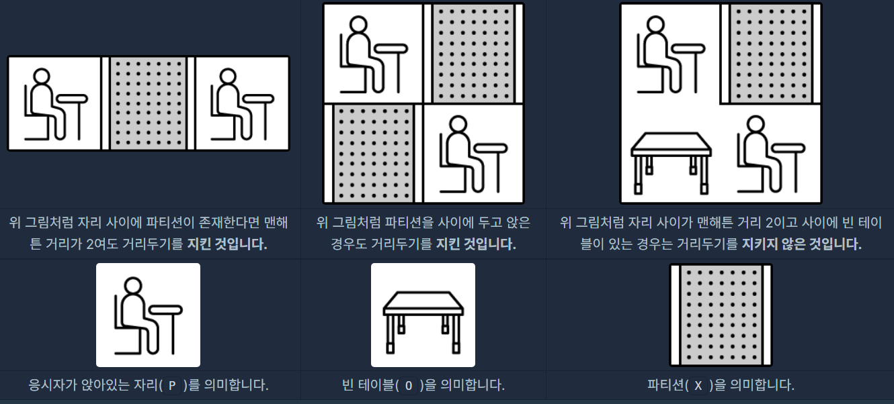
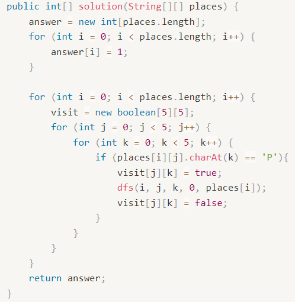
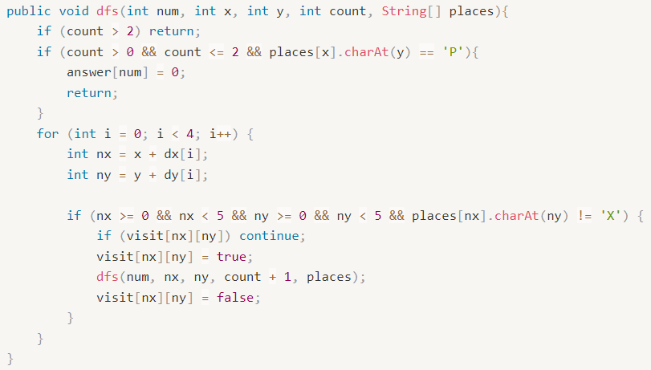

위 문제는 "거리두기 확인하기"에 관한 설명이다.

---

## 문제 설명

코로나 바이러스 감염 예방을 위해 응시자들은 거리를 둬서 

대기를 해야하는데 개발 직군 면접인 만큼

아래와 같은 규칙으로 대기실에 거리를 두고 앉도록 안내하고 있습니다.

> 대기실은 5개이며, 각 대기실은 5x5 크기입니다.
>
> 거리두기를 위하여 응시자들 끼리는 맨해튼 거리1가 2 이하로 앉지 말아 주세요.
>
> 단 응시자가 앉아있는 자리 사이가 파티션으로 막혀 있을 경우에는 허용합니다.

예를 들어,



5개의 대기실을 본 죠르디는 각 대기실에서 응시자들이 거리두기를 잘 기키고 있는지 알고 싶어졌습니다.
 
자리에 앉아있는 응시자들의 정보와 대기실 구조를 대기실별로 담은 
 
2차원 문자열 배열 places가 매개변수로 주어집니다. 
 
각 대기실별로 거리두기를 지키고 있으면 1을, 
 
한 명이라도 지키지 않고 있으면 0을 배열에 담아 return 하도록 
 
solution 함수를 완성해 주세요.

## 제한사항

places의 행 길이(대기실 개수) = 5
* places의 각 행은 하나의 대기실 구조를 나타냅니다.

places의 열 길이(대기실 세로 길이) = 5

places의 원소는 P,O,X로 이루어진 문자열입니다.
* places 원소의 길이(대기실 가로 길이) = 5
* P는 응시자가 앉아있는 자리를 의미합니다.
* O는 빈 테이블을 의미합니다.
* X는 파티션을 의미합니다.

입력으로 주어지는 5개 대기실의 크기는 모두 5x5 입니다.

return 값 형식
* 1차원 정수 배열에 5개의 원소를 담아서 return 합니다.
* places에 담겨 있는 5개 대기실의 순서대로, 거리두기 준수 여부를 차례대로 배열에 담습니다.
* 각 대기실 별로 모든 응시자가 거리두기를 지키고 있으면 1을, 한 명이라도 지키지 않고 있으면 0을 담습니다.

## 소스코드

```java
import java.util.*;
class Solution {
    static int[] dx = {-1, 0, 1, 0};
    static int[] dy = {0, 1, 0, -1};
    static boolean[][] visit;
    static int[] answer;

    public int[] solution(String[][] places) {
        answer = new int[places.length];
        for (int i = 0; i < places.length; i++) {
            answer[i] = 1;
        }

        for (int i = 0; i < places.length; i++) {
            visit = new boolean[5][5];
            for (int j = 0; j < 5; j++) {
                for (int k = 0; k < 5; k++) {
                    if (places[i][j].charAt(k) == 'P'){
                        visit[j][k] = true;
                        dfs(i, j, k, 0, places[i]);
                        visit[j][k] = false;
                    }
                }
            }
        }
        return answer;
    }
    
    public void dfs(int num, int x, int y, int count, String[] places){
        if (count > 2) return;
        if (count > 0 && count <= 2 && places[x].charAt(y) == 'P'){
            answer[num] = 0;
            return;
        }
        for (int i = 0; i < 4; i++) {
            int nx = x + dx[i];
            int ny = y + dy[i];

            if (nx >= 0 && nx < 5 && ny >= 0 && ny < 5 && places[nx].charAt(ny) != 'X') {
                if (visit[nx][ny]) continue; 
                visit[nx][ny] = true;
                dfs(num, nx, ny, count + 1, places);
                visit[nx][ny] = false;
            }
        }
    }
}
```

## 문제풀이



나누어서 보면 솔루션 부에서는 answer에 모든 값으로 1을 넣어줬다.

static형으로 설정을 해서 dfs를 진행하는 와중에도 내용을 변경할 수 있기 위함.

그리고 각 대기실의 갯수만큼 반복문을 구성한다.

대기실 별로 방문을 했는지 안했는지에 대해 확인하는 2차원배열을 만들어준다.

만약 사람이 앉아있다면(`P`상태) dfs를 진행합니다.



dfs는 다음과 같은 구성을 가진다.

조건부 1 : 2칸이상인 경우는 문제없는 상태.

조건부 2 : 0칸보다는 크고(본인 좌석),<br>2칸보다는 작은상태에 사람이 앉아있다면<br>거리두기 준수가 안된 상황

탐색부로 나누어진다.

탐색부는 4개의 방향에 대해 하나씩 확인하며,

다음 도착할 위치가 범위 내에있는지와 파티션(`X`)인지 확인한다.

방문을 한곳이면 넘어가고,

안했다면 방문한 상태로 넘어가고 그 위치로 넘어가서 

다시 DFS를 진행한다.

### 문제링크 : 

<a href="https://programmers.co.kr/learn/courses/30/lessons/81302">Programmers-거리두기 확인하기</a> 

---
