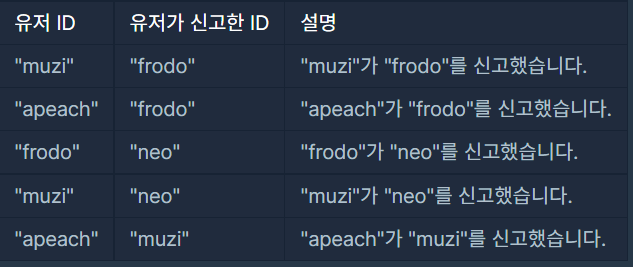
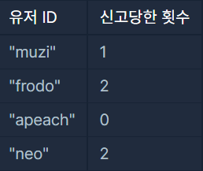
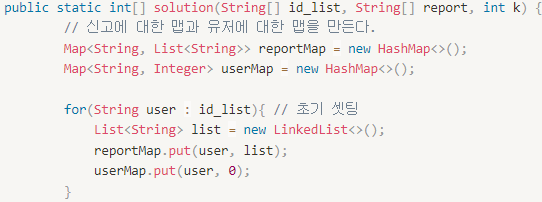
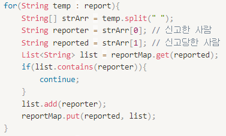
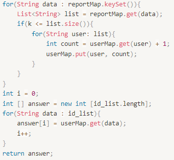

위 문제는 "신고 결과 받기"에 관한 설명이다.

---

## 문제 설명

신입사원 무지는 게시판 불량 이용자를 신고하고 처리 결과를 메일로 발송하는 시스템을 개발하려 합니다.

무지가 개발하려는 시스템은 다음과 같습니다.

* 각 유저는 한 번에 한 명의 유저를 신고할 수 있습니다.
    * 신고 횟수에 제한은 없습니다. 서로 다른 유저를 계속해서 신고할 수 있습니다.
    * 한 유저를 여러 번 신고할 수도 있지만, 동일한 유저에 대한 신고 횟수는 1회로 처리됩니다.
* k번 이상 신고된 유저는 게시판 이용이 정지되며, 해당 유저를 신고한 모든 유저에게 정지 사실을 메일로 발송합니다.
    * 유저가 신고한 모든 내용을 취합하여 마지막에 한꺼번에 게시판 이용 정지를 시키면서 정지 메일을 발송합니다.

다음은 전체 유저 목록이 ["muzi", "frodo", "apeach", "neo"]이고, k = 2(즉, 2번 이상 신고당하면 이용 정지)인 경우의 예시입니다.



각 유저별로 신고당한 횟수는 다음과 같습니다.



## 제한사항
* 2 ≤ id_list의 길이 ≤ 1,000
    * 1 ≤ id_list의 원소 길이 ≤ 10
    * id_list의 원소는 이용자의 id를 나타내는 문자열이며 알파벳 소문자로만 이루어져 있습니다.
    * id_list에는 같은 아이디가 중복해서 들어있지 않습니다.
* 1 ≤ report의 길이 ≤ 200,000
    * 3 ≤ report의 원소 길이 ≤ 21
    * report의 원소는 "이용자id 신고한id"형태의 문자열입니다.
    * 예를 들어 "muzi frodo"의 경우 "muzi"가 "frodo"를 신고했다는 의미입니다.
    * id는 알파벳 소문자로만 이루어져 있습니다.
    * 이용자id와 신고한id는 공백(스페이스)하나로 구분되어 있습니다.
    * 자기 자신을 신고하는 경우는 없습니다.
* 1 ≤ k ≤ 200, k는 자연수입니다.
* return 하는 배열은 id_list에 담긴 id 순서대로 각 유저가 받은 결과 메일 수를 담으면 됩니다.

## 소스코드

```java

public static int[] solution(String[] id_list, String[] report, int k) {
        Map<String, List<String>> reportMap = new HashMap<>();
        Map<String, Integer> userMap = new HashMap<>();

        for(String user : id_list){
            List<String> list = new LinkedList<>();
            reportMap.put(user, list);
            userMap.put(user, 0);
        }

        for(String temp : report){
            String[] strArr = temp.split(" ");
            String reporter = strArr[0];
            String reported = strArr[1];
            List<String> list = reportMap.get(reported); 
            if(list.contains(reporter)){ 
                continue;
            }
            list.add(reporter);
            reportMap.put(reported, list);
        }
        for(String data : reportMap.keySet()){
            List<String> list = reportMap.get(data);
            if(k <= list.size()){
                for(String user: list){
                    int count = userMap.get(user) + 1;
                    userMap.put(user, count);
                }
            }
        }
        int i = 0;
        int [] answer = new int [id_list.length];
        for(String data : id_list){
            answer[i] = userMap.get(data);
            i++;
        }
        return answer;
    }

```

## 문제풀이



나누어서 보면 신고와 유저에 대한 Map을 만든다.

그리고 초기셋팅을 해준다.

reportMap에는 유저와 list값을 넣을 것이다.

userMap에는 유저와 신고횟수를 넣을 것이다.



이제 report에서 하나씩 가져온다.

신고한 사람과 신고당한 사람은 공백을 기준으로 구분된다.

이제 신고당한사람을 reportMap에서 가져와본다.

리스트에 신고자가 포함되어있다면 생략한다.

아니라면 리스트에 신고자를 추가하고,

reportMap을 갱신한다.



위 과정을 다 거치고 나면 keySet을 이용해 

reportMap에 있는 데이터를 data로 가져온다.

데이터에 있는 중 list를 뽑아내 정지기준을 넘는지 확인한다.

해당 유저에 대해서 신고된 횟수를 확인해 userMap 갯수를 넣어준다.

answer에 옮겨준다.

### 문제링크 : 

<a href="https://programmers.co.kr/learn/courses/30/lessons/92334">[Programmers]신고 결과 받기</a> 

---
