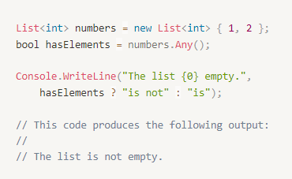
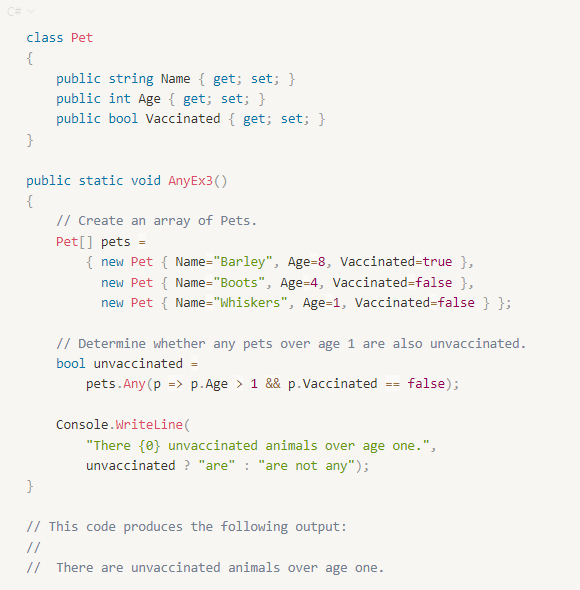
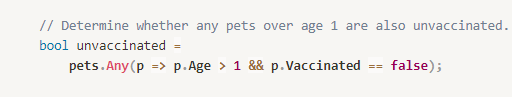

C#에서의 List에서 조건으로 데이터를 찾아내는 것에 이어

데이터가 존재하는지도 확인해본다.

---

## 언제 사용하는가?

이전에 List 형태로 여러개의 데이터를 한번에 가져와서

조건으로 해당 데이터가 존재한다면 데이터를 가져오는

<b>"Find()"</b>에 대해서 알아보았다.

굳이 데이터를 가져오지 않고,

존재의 유무만 bool값으로 확인하고 싶은 경우도 있다.

그럴때 Any()를 사용하자.

## Any()란?

Enumerable.Any 메서드.

<b>"시퀀스에 요소가 하나라도 있는지"</b> 또는 

<b>"특정 조건에 맞는 요소가 있는지 확인합니다."</b>

예시를 통해 알아보면

다음의 코드처럼 List에 값이 있고,

그것을 Any로 판별했을때 값이 있으니

출력으로는 is not이 나타나게 된다.

## 반환되는 값

Boolean 형식으로 시퀀스에 

요소가 있으면 true, 그렇지 않으면 false를 반환한다.

## 조건도 넣을 수 있다.

Pet이라는 클래스에서는 

이름, 나이, 백신접종여부 속성을 가지게 한다.

3개에 대한 Pet 정보를 초기값으로 넣고,

1살보다 많으면서 백신접종여부가 false인 

Pet이 존재하는지에 대해서 알고싶다.

그에 대한 것을 식으로 바꾸어서 다음과 같이 표현한다.

2번째로 넣었던 Pet 정보가 그것에 해당하니,

백신 미접종인 1살이상의 Pet이 존재한다고 나타난다.

### 참고링크 : 

<a href="https://docs.microsoft.com/ko-kr/dotnet/api/system.linq.enumerable.any?view=net-6.0#code-try-1">MS - Net6.0 공식문서</a> 

<a href="https://junghyun100.github.io/C-List%EC%97%90%EC%84%9C-%EC%A1%B0%EA%B1%B4%EC%9C%BC%EB%A1%9C-%EC%B0%BE%EA%B8%B0/">이전 포스트</a>

---
