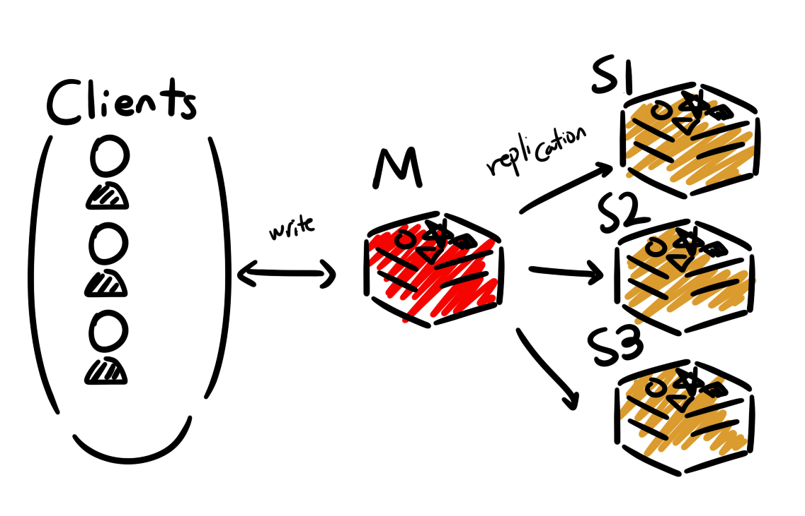

우리 회사에서는 Redis Cluster 환경을 사용하고 있다.

Redis Cluster의 환경과 일반 Redis의 형태와 어떤 차이인가 알게된 내용을 간단하게 회고하며 정리해본다.

이 글에서는 Redis에 대해서나 명령어에 대한 내용은 간략하게만 설명할 예정이다.

---

## Redis란 무엇인가?

Redis는 Remote Dictionary Server의 약자로, 인메모리 기반의 Key-Value의 DB이다.

### 풀어서 작성해보면?

위 처럼말 작성하면 복잡할 수 있으니 단어들을 풀어서 설명해보자면 다음과 같다.

**Remote(원격)** : 클라이언트가 Redis 서버에 **원격**으로 연결이 가능하다.

**Dictionary(사전)** : 데이터를 키-값(Key-Value) 쌍으로 저장하는 구조를 가진다.

**Server(서버)** : 클라이언트의 요청을 처리할 수 있도록 데이터에 대한 저장, 검색, 관리에 대한 역할을 수행한다.

**인메모리 기반** : 데이터들을 메모리 안에 저장하고 처리한다. 메모리 기반으로 되어있기 때문에 디스크 기반인 데이터베이스들 보다 빠른 속도를 제공한다.

이것에 대한 사용법들은 아래의 공식문서를 참고하거나, 다른 글을 찾아가는 것을 권장한다.

공식문서 Link : <a href="https://redis.io/docs/latest/develop/">공식문서</a>

## Redis Master/Slave

Redis Master/Slave 

Master / Slave 구조는 데이터의 복제와 읽기/쓰기 작업을 분리하여 성능과 가용성을 높이는 기본적인 아키텍쳐이다.

**Master**의 역할 : 모든 쓰기(Write) 작업을 처리한다. 그림상에서는 M을 의미

**Slave**의 역할 : Master의 데이터를 복제해서 가지고 있는다. Read 작업을 처리하며 Master의 부하를 분산시킨다. Slave가 여러개인 상황에서 Master가 고장이 난다면 Slave 중 하나를 Master로 FailOver시키는 방안이 가능하다.

### 특징

1.구성이 비교적 간단하다. (장점)

2.Slave들에 동일한 데이터를 가질 수 있도록 복제되어 있기 때문에 읽기 요청을 분산 처리하기 좋다. (장점)

3.복제된 데이터를 가지고 유지하므로 데이터에 대한 손실 위험을 줄일 수 있다. (장점)

4.모든 쓰기가 Master에 집중이 되므로 많은 양의 데이터를 쓰는 경우 부하가 쌓여 병목현상이 생길 수 있다. (단점)

5.모두가 같은 데이터를 복제하고 있기에, 데이터를 분산하지 못해 저장 용량에 대한 한계가 명확하다. (단점)

### Master-Slave 구조의 장애 처리는?

**(Slave가 여럿있다는 가정하에 진행한다.)**

Master가 장애 발생 시, Slave 중 하나를 새로운 Master로 승격시킨다. 

승격된 새로운 Master에 다른 Slave들이 재연결하여 복제를 수행한다.

이것에 대해서 확장된 개념으로 Redis Sentinel이 있으며 이 경우 자동 장애 조치(Auto Failover)를 수행할 수 있다. 

---
