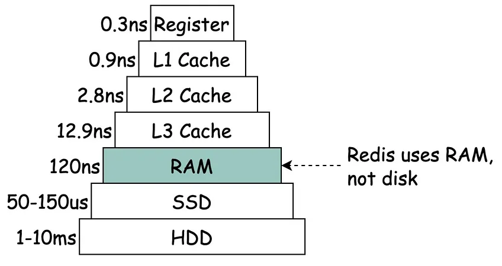
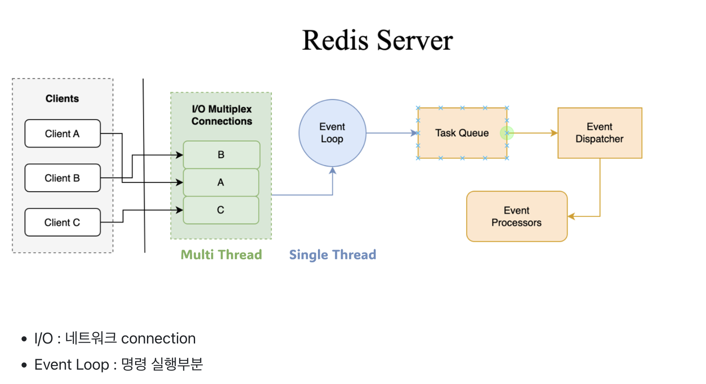

Redis를 사용하고 있는 상황에서 왜 Redis가 단일 스레드를 유지하는 가에 대한 궁금증이 생겨서 찾아봤습니다.

---

# Redis가 단일 스레드(single-threaded)를 사용하면서 얻는 장점? 

### 1. 상대적으로 간단한 설계와 구현

단일 스레드 모델은 멀티 스레드 모델에 비해 설계와 구현이 상대적으로 간단하다.

멀티 스레드 환경에서는 동시성 문제가 발생할 수 있기 때문에 이를 해결하기 위한 추가 구현 혹은 기술이 필요한데,

단일 스레드 환경에서는 이런 문제를 회피할 수 있다.

### 2. 네트워크 요청을 효율적으로 처리

이벤트 기반의 아키텍쳐를 채택하여 네트워크 요청을 효율적으로 처리한다.

단일 스레드의 이벤트 루프는 비동기적으로 여러 클라이언트의 요청을 처리할 수 있으며,

이를 통해 높은 동시성을 구현할 수 있다.

멀티 스레드 모델에서는 이러한 비동기 처리의 이점을 충분히 활요하기 어려울 수 있다.

### 3. 오버헤드를 줄임

메모리 기반으로 되어있기 때문에 디스크 기반인 데이터베이스들 보다 빠른 속도를 제공한다.

단일 스레드의 이벤트 루프를 사용함으로써 컨텍스트 스위칭에 소요되는 오버헤드를 최소화할 수 있다.

<a style="text-align:center;" href="https://velog.io/@rlafbf222/NoSQL-vs-RDB">이미지 출처</a>

Redis의 6.0부터는 클라이언트로 부터 전송된 네트워크를 읽는 부분에서 멀티스레드를 이용한 연결

---
