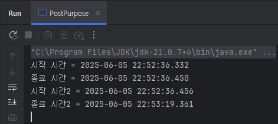

 
해당 Post는 실무에서 대용량 데이터를 다루는 애플리케이션에서 성능을 올리기 위해 고민하다가 알게된 점을 작성합니다.

예를 들어, 조회해야하는 상품 혹은 SKU의 정보가 100만 건 이상의 데이터를 기반으로 

어떤 데이터를 추출해야하는 상황이 있을 수 있습니다.

C#의 LINQ와 Java의 Stream은 가독성과 편리함을 제공하지만, 100만 건 이상의 데이터에서는 성능 병목을 초래할 수 있습니다.

이번 포스트에서는 Dictionary/HashMap 기반 조회와 LINQ/Stream 기반 필터링의 성능을 비교하고,

대규모 데이터 처리에서 어떤 방식을 선택했는지 정리해봅니다. 

---

### 시나리오: 어떤 문제를 해결할까?

다음 상황을 가정합니다.

1.**객체 A의 List**와 **객체 B의 List**는 **각각 10만 건**의 데이터를 포함하고 있습니다.<br> 
(더 많은 데이터를 사용해보려다 너무 오래걸려서 10만건으로 정정)

2.객체 A에서 객체 B에 포함된 항목만 추출해 새로운 리스트 생성하고자 합니다.

3.객체 A와 B는 예시이므로 간단한 구조를 가지고, ID를 기준으로 매핑한다고 가정합니다.
 
```java
// C# 객체 예시
public class ObjectA { 
    public int Id { get; set; } 
    public string Name { get; set; } 
}
public class ObjectB { 
    public int Id { get; set; } 
    public string Category { get; set; } 
}
```
```java
// Java 객체 예시
@Getter
@Setter
class ObjectA {
  private int id;
  private String name;

  public ObjectA(int i) {
    this.id = i;
    this.name = String.valueOf(i);
  }
}
@Getter
@Setter
class ObjectB {
  private int id;
  private String category;

  public ObjectB(int i) {
    this.id = i;
    this.category = String.valueOf(i);
  }
}

```

## 두 가지 로직을 비교합니다.

### 1. Dictionary/HashMap 방식

객체 B의 리스트를 Dictionary(C#) 또는 HashMap(Java)으로 변환 후, 객체 A를 반복하며 조회

### 2. LINQ/Stream 방식: 

객체 A에서 LINQ의 Where(C#) 또는 Stream의 filter(Java)를 사용해 객체 B에 포함된 항목 필터링

## 성능 분석: 이론적으로 어떤 방식이 빠를까?

### 1.Dictionary/HashMap 방식

* 작동 원리:
  * 객체 B의 리스트를 Dictionary/HashMap으로 변환 (키: ID, 값: 객체 B)
  * 객체 A를 순회하며 Dictionary/HashMap에서 ID를 조회해 매칭된 항목을 새 리스트에 추가<br><br>
* 시간복잡도:
  * Dictionary(C#)와 HashMap(Java)은 해시 테이블 기반, 평균 조회 시간복잡도 O(1)
  * 객체 B를 Dictionary/HashMap으로 변환: O(m) (m: 객체 B 크기, 10만)
  * 객체 A를 순회하며 조회: O(n) (n: 객체 A 크기, 10만)
  * 총 시간복잡도: O(n + m), 즉 약 20만 연산<br><br>
* 메모리: 해시 테이블로 추가 메모리 사용 (10만 건 기준 약 2~3배)

### 2.LINQ/Stream 방식

* 작동 원리:
   * 객체 A의 리스트에서 LINQ의 Where 또는 Stream의 filter를 사용
   * 각 객체 A의 ID가 객체 B 리스트에 있는지 확인 (Contains 또는 anyMatch의 방식)<br><br>
* 시간복잡도:
   * 객체 B의 Contains/anyMatch는 O(m), 즉 10만 연산
   * 객체 A의 각 원소(10만)마다 호출하므로 총 시간복잡도: O(n * m), 즉 약 100억 연산
   * 더 많은 데이터에서는 심각한 성능 저하 발생<br><br>
* 메모리: 추가 자료구조 없이 리스트만으로 사용이 가능


위 내용을 요약하면 다음과 같이 정리할 수 있습니다.

| 방식                      | 시간복잡도   | 대용량(10만 건) 성능 | 메모리   |
|-------------------------|-------------|---------------------|-------|
| Dictionary / HashMap 조회 | O(n + m)    | 매우 빠름           | 사용 많음 |
| LINQ / Stream + List 검색 | O(n * m)    | 매우 느림           | 사용 적음 |

이론적으로 Dictionary/HashMap이 LINQ/Stream보다 훨씬 효율적입니다. 

실제로 성능은 어떨까요? (Java인 유형만 확인해 봅니다.)

# 10만 건 데이터의 실제 성능

10만 건 데이터를 기준으로 Java에서 두 방식의 성능을 테스트했습니다.

```java
        List<ObjectA> listA = IntStream.range(1, 100000).mapToObj(ObjectA::new).toList();
        List<ObjectB> listB = IntStream.range(1, 100000).mapToObj(ObjectB::new).toList();

        // HashMap 방식
        Map<Integer, ObjectB> mapB = listB.stream().collect(Collectors.toMap(ObjectB::getId, b -> b));
        List<ObjectA> result1 = new ArrayList<>();
        for (ObjectA a : listA) {
            if (mapB.containsKey(a.getId())) result1.add(a);
        }
        
        // Stream 방식
        List<ObjectA> result2 = listA.stream().filter(a -> listB.stream()
                .anyMatch(b -> b.getId() == a.getId())).toList();
```

결과는 다음과 같이 나옵니다.

### 이것을 표로 정리하면?



|       | HashMap                 | Stream                  | 배율        |
|-------|-------------------------|-------------------------|-----------|
| 시작 시간 | 2025-06-05 22:52:36.332 | 2025-06-05 22:52:36.456 |           |
| 종료 시간 | 2025-06-05 22:52:36.450 | 2025-06-05 22:53:19.361 |           |
| 차이    | 0.118초 = 118ms          | 42.905초 = 42,905ms      | ≈ 363.77배 |

## 결론

대량의 데이터를 처리한다면, Dictionary/HashMap이 필수라고 생각 됩니다. 

LINQ와 Stream은 가독성이 뛰어나지만, 10만 건에서도 실행 시간이 수십 초를 초과합니다.

예시로는 10만 건이지만 실제로는 100만 건 혹은 그 이상에 객체가 담긴 List가 N개가 더 있을 수 있습니다.

그렇다면 해당 부분에서 병목 현상이 발생하게 됩니다.

각각의 장 단점이 있으므로 **각자의 기준**을 세우면 될 것 입니다.

속도 향상으로 메모리에 대한 트레이드오프 정당화가 될 수 있다면 Dictionary/HashMap가 좋고,

소규모 데이터(제 기준 1000건 정도)인 경우 LINQ / Stream을 이용하는 것도 방법이 될 것 입니다.

---
