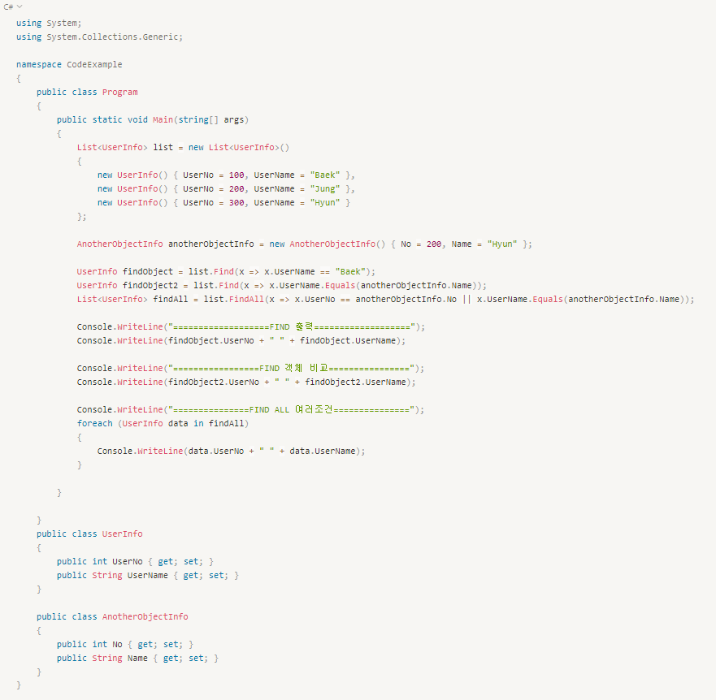
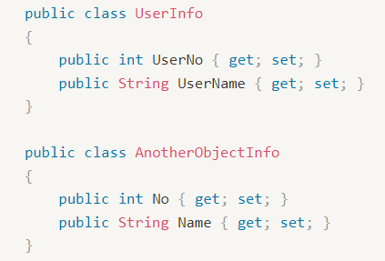
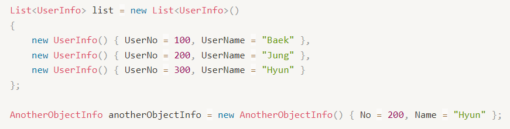
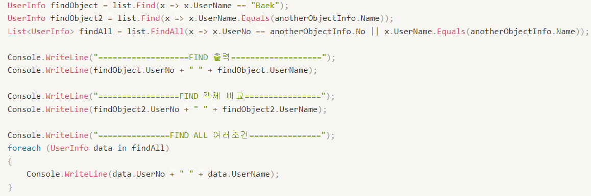
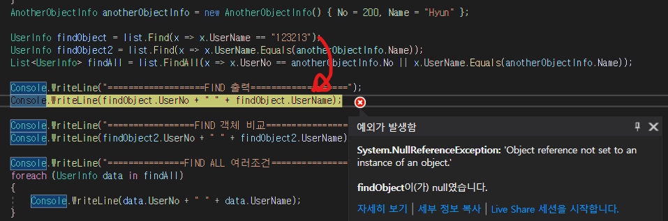
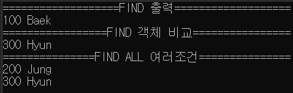
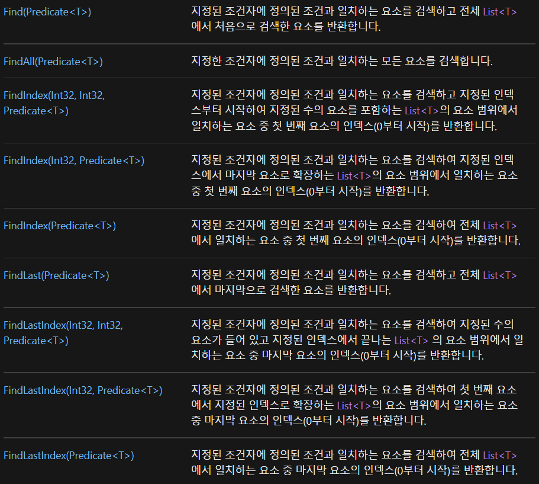

C#에서의 List에서 조건으로 

데이터를 찾아내는 것을 알아본다.

---

## 상황 설명

업무 도중 어떤 객체를 기준으로

다른 테이블에 해당 객체가 있는지를 확인해야 했다. 

일정기간에 대해 일치하는 데이터들을 List로 한번에 가져왔다.

foreach를 통해 하나씩 순차하는 방법도 있지만,

List의 객체에 있는 <b>Find</b>와 <b>FindAll</b>라는 방식을 사용했다.

간단하게 예시를 만들어보았다.

객체의 모습은 다음과 같다.

<b>UserInfo</b>는 사람 번호와 이름을,

<b>AnotherObjectInfo</b>번호와 이름을 받는다.

> AnotherObjectInfo 는 다른 객체에 있는 것도 조건으로 사용할 수 있다는걸 보여주고 싶어서 만듦.

객체에 값들을 집어넣는다.

이제 <b>Find</b>와 <b>FindAll</b>을 사용해본다.

<b>Find</b>나 <b>FindAll</b>에 일치하지 않는 경우 Null 값을 반환하므로 

System.NullReferenceException이 발생할 수 있다는걸 알아둬야 한다.

정상출력이 된다는 가정하에,

출력을 하면 다음과 같이 나온다.

조건식을 쓴 모습이 자바에서는 스트림의 filter와 유사해보인다.

공식문서를 찾아보면 내용은 다음과 같다.

### 참고링크 : 

<a href="https://docs.microsoft.com/ko-kr/dotnet/api/system.collections.generic.list-1?view=net-6.0">MS - Net6.0 공식문서</a> 

<a href="https://khj93.tistory.com/entry/JAVA-%EB%9E%8C%EB%8B%A4%EC%8B%9DRambda%EB%9E%80-%EB%AC%B4%EC%97%87%EC%9D%B4%EA%B3%A0-%EC%82%AC%EC%9A%A9%EB%B2%95">[JAVA] 람다식(Lambda)의 개념 및 사용법</a>

---
