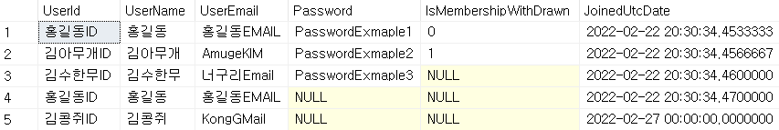
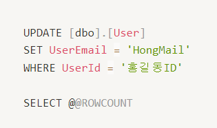
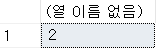
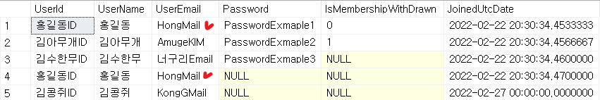

MSSQL에서 @@ROWCOUNT 관한 설명이다.

---

## @@ROWCOUNT란?

DB에서 데이터를 수정하거나 하는 경우

몇개에 대해서 변경을 했는지 확인하거나, 

변경이 되었는지 확인하고 싶은 경우가 있다.

그때 @@ROWCOUNT를 사용한다.

기능은 <b>"최근 실행된 문의 영향을 받은 행 수를 반환합니다."</b>

테이블의 모습은 위와 같다.

> 예시로 나온 UserId는 기본키로 보통 설정하겠지만 
> 간단한 예시이므로 넘어가 주시기 바랍니다. :)..

UserId에서 홍길동ID를 사용하는 사람의 UserEmail을

새로만든 이메일로 변경하고자 한다.

UPDATE문을 설정해 Email을 `HongMail`로 변경한다.

이렇게 진행했을때 테이블에서 `홍길동ID`은

2개이므로 결과값은 다음과 같이 나타난다.

2개가 변경되었는지 확인하고자 테이블을 확인한다면

테이블상 체크된 2개가 변경된 것을 확인할 수 있다.

### 참고링크 : 

<a href="https://docs.microsoft.com/ko-kr/sql/t-sql/functions/rowcount-transact-sql?view=sql-server-ver15">[MSSQL] 공식문서</a> 

---
