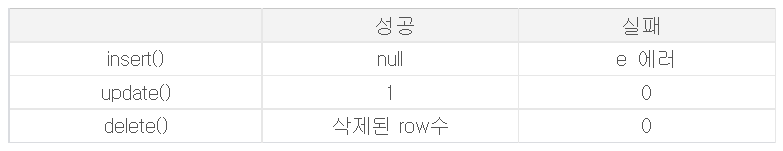

iBatis를 사용하다가 발견한 내용이다.

---

## iBatis(아이바티스)란?

SQL에 기반한 데이터베이스와 자바, 닷넷(.NET), 루비(Ruby) 등을 

연결시켜 주는 역할을 하는 프레임워크(Framework)이다.

iBatis가 MyBatis의 옛날 버전이라 큰 차이점은 없다고 생각했다.

안일한 생각에 로컬에서 시간을 꽤나 잡아먹었다.

* Select - Select문에 해당하는결과
* Insert - 1 (여러개일경우도 1)
* Update - Update된 행의 개수 반환 (없다면 0)
* delete - Delete된 행의개수 (없다면 0)

Mybatis의 경우 위 처럼 동작을 하게 되는데.

이때 Insert를 진행하고나서 

<b>@@RowCount</b>로 Insert에 대한 History도 남기고 

반환되는 1의 값을 보고 이후 작업의 로직을 정하고자 했다.

계속 Exception이 발생했고 발생한 내용은 <b>Null과 관련된 내용</b>이었다.

왜 Null 값이 자꾸나오는가 고민하다가,

발견한 내용은 다음과 같다.

성공시에 null 값이 나오는걸 보고 잘못된 것이라 생각했고

레퍼런스를 찾아보려했지만 너무 오래되어 

mybatis 홈페이지로 넘어가게 된다.

혹시나 보게 된다면 참고바랍니다.

### 참고링크 : 

<a href="https://blog.naver.com/PostView.nhn?isHttpsRedirect=true&blogId=byacj&logNo=120167314925&redirect=Dlog&widgetTypeCall=true">byacj님의 블로그</a> 

---
