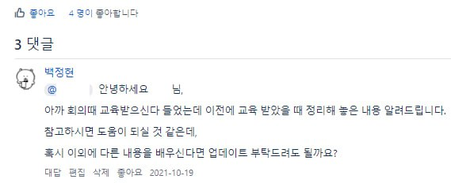
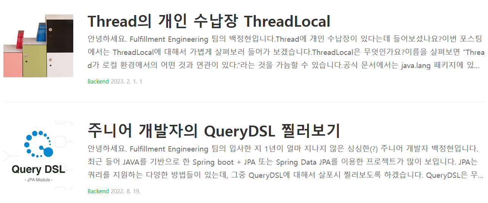
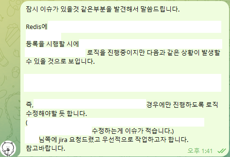
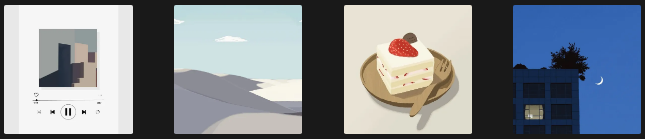

당시 Notion에 작성되어있던 글을 블로그에도 옮겨봅니다.

2021년 4월 12일부로 회사에 입사해 어느덧 2023년 4월 12일, 만 2년차를 넘긴 개발자가 되었습니다.

2년이란 시간 동안 Fulfillment Engineering팀에서 Order Management System을 담당하면서 아직 배워야 하는 점들이 많지만 꾸준히 발전하기 위해 노력하고 있습니다.

회사에서 자리도 어느 정도 잡았고, 여유가 생기게 되어 그 동안 해보고자 했던 회고록을 작성해봅니다.

---

## 첫 입사 당시..

입사하던 당시는 코로나가 가장 유행하던 시기로, 취업을 했음에도 원격으로만 근무가 가능했습니다.

당시 기억으로는 사수님은 개인 사정으로 1주 가량 휴가 상태 중이었고, 그 사이에 무엇을 해야 할지 몰랐던 경험이 있습니다.

누가 따로 시킨 게 없다면 사내 Wiki를 보면서 업무 파악을 하라는 답변을 받았는데,

그중에는 작성된 지 오래되어 현재와 다른 점이 있거나 물류의 비즈니스적인 개념을 모른다면 이해하기 어려운 페이지들도 많이 있었습니다.

알고 보니 신입이 들어온 지 N년 정도 되었다고 하며, 신입에 대한 교육 자료가 아주 예전 버젼이라고 했습니다.

## 첫 결심이 그 이후로 계속..

이후에 따로 교육을 받으면서 한 가지 결심했던 것은 배운 내용들을 정리하면서,

다음으로 들어올 신입 분이 더 편하게 적응할 수 있도록 교육 자료를 만들어두자는 생각이었습니다.

물류에서의 개념과 회사에서의 개괄적인 비즈니스 로직 등에 대한 정리를 넣어 위키에 교육 자료를 만들었고, 팀 내에 도움이 되지 않았을까 생각합니다.

이후로 다른 사람에게 도움이 되고자 공유하는 기회를 많이 가졌습니다.

대학교 취업센터에 있던 분께 요청이 와 대구대에서 기업 강의를 섰거나, 기술블로그의 테크에디터에도 지원해 글도 작성했었습니다.

https://dev.gmarket.com/ (많이 관심 가져주셨으면 좋겠습니다.)

글을 작성하는 과정을 겪으면서 잘못된 정보를 제공할까 걱정되어 많은 공부를 했었습니다.

이 또한 저에게 도움이 많이 되었습니다.

## 업무적인 부분에서..

**프로젝트 중에서는?**

[더 빠른 배송이란?](https://help.gmarket.co.kr/Tcs/NoticeCore/NoticeDetail?Kind=P&SeqNo=22111)

업무적인 내용중 가장 기억에 남는 프로젝트는 더 빠른 배송 입니다.

론칭까지 약 6개월의 기간을 두고 기획 단계부터 회의를 들어갔던 프로젝트였습니다.

프로젝트를 진행하면서 2가지의 admin 페이지를 담당했습니다.

그러던 중 QA에 진입 7일 전 Redis에 들어가는 key의 설계에서 문제가 있을 듯한 부분을 발견해 원인, 해결방안 확인, 공유 후 빠르게 작업을 진행하면서 가장 진땀흘렸던 순간이라 할 수 있습니다.

처음 맡은 가장 큰 프로젝트이자, 입사 후 처음 실수를 해본 프로젝트이자, 그럼에도 아쉽게도 종료된 프로젝트 입니다.

## 업무 외 적인 부분에서..

스트레스 관리를 위해 취업을 하고 다른 취미를 하나 가지고 싶어졌습니다.

어떤 취미를 가져야 할지 고민하다 개발과 비슷하게 머릿속에 있는 것을 그대로 가져올 수 있는 것을 하면 좋겠다는 생각이 들어 그림에 취미를 가지게 되었습니다.

그림을 그리다 보면 다른 생각이 없어지고, 생각보다 시간이 많이 들지만 천천히 조금씩 시간을 들이다 보면 좋은 결과물이 나오게 됩니다.

아는 만큼 보인다고 하던가, 나중에 다시 보면 고칠 점들이 눈에 보이게 됩니다.

## 내년에는..

개발자이기 앞서서 직장인, 사회인으로서 좀 더 공부해야 할 부분이 있다고 생각합니다.

**소프트적인 스킬**로써 고쳐야 할 점은 무언가 막히는 부분이 있을 때, 팀원들에게 물어보기 전 소위 말하는 ‘핑거 프린세스’ 가 되는 건 아닐 걱정하며 오래 찾아보고 이야기를 꺼내는 습관이 있었습니다.

이 점에 대해서 팀원에게 받은 답변은 아래와 같습니다.

“어디가 막혔는지에 대해서 파악하고 그 부분에 대해서 도움을 받았다면 금방 풀렸을 텐데 그게 중요한 스킬 셋인 것 같다.“

1년 차부터 이런 점이 크게 마음에 와닿아 이후로 노력하고 있는 입장입니다.

새롭게 도전해야 할 것으로는 운동입니다.

재택으로 인해 1년 동안 13kg 가량이 쪄서 많이 둔해졌고, 몸이 건강하지 않아진 게 확연히 느껴져 운동을 시작할까 합니다.

평소에도 운동을 그리 좋아하는 편은 아니었지만 조금씩 습관을 지녀야겠다는 생각을 해봅니다.

---
